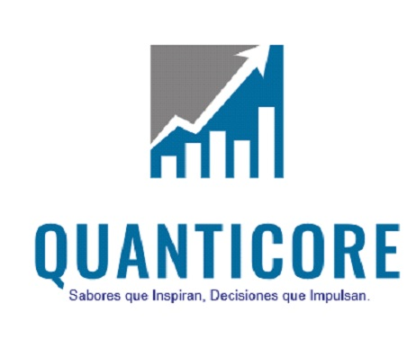

<h1 align=center> Proyecto Grupal: 
<h1 align=center>Sistema de Recomendación de restaurantes basado en reviews de Google Maps y YELP </h1>

---

## **Tabla de contenidos**

- [Quienes Somos](#quienes-somos)
- [Nuestro Equipo](#nuestro-equipo)
- [Descripción del Proyecto](#descripción-del-proyecto)
- [Alcance](#alcance)
- [Metodología de trabajo](#metodología-de-trabajo)
- [Stack Tecnológico](#stack-tecnológico)

----

## **Quienes Somos**

Bienvenido a Quanticore, una empresa joven que fusiona sabores inspiradores con decisiones impulsadas por la inteligencia artificial (IA). Nos especializamos en la integración de IA para Business Intelligence, brindando a nuestros clientes herramientas innovadoras que potencian sus inversiones y simplifican la búsqueda de restaurantes afines a sus preferencias.

**Misión** :
En Quanticore, nuestra misión es facilitar a todas las empresas e individuos el desarrollo de un entorno automatizado de toma de decisiones basado en datos, con un impacto directo en la percepción del cliente. Nos esforzamos por ser líderes en la aplicación de tecnologías avanzadas para optimizar la toma de decisiones, permitiendo a nuestros clientes ahorrar tiempo y dinero de manera eficiente.

**Visión**:
En nuestra visión, consideramos las reviews como la brújula de nuestra excelencia. Cada comentario representa un pilar que fortalece nuestra calidad y guía nuestras decisiones estratégicas. Buscamos crear un ecosistema donde la retroalimentación se convierte en un activo valioso, impulsando continuamente la mejora y la satisfacción del cliente.

En Quanticore, nos destacamos por ofrecer soluciones tecnológicas de vanguardia y un compromiso constante con la excelencia en el análisis de datos. Trabajamos incansablemente para ser la elección preferida de aquellos que buscan transformar la información en resultados significativos.

---

## **Nuestro Equipo**

- [CÁCERES, Juan Patricio](https://github.com/Sanosuke298), Data Scientist
- [GARCIA, Robertino](https://github.com/RobertinoS), Data Engineer
- [LOPEZ, Stiven](https://github.com/StivenLopez712), Data Scientist
- [MARTINEZ, Gabriela](https://github.com/magamahae), Data Engineer
- [RENGIFO, Aylin](https://github.com/AylinRengifo), Data Analytics

---

## **Descripción del Proyecto**
Quanticore se embarcará en un análisis exhaustivo y eficiente de las reseñas de usuarios en Google Maps y Yelp, centrándose en los restaurantes ubicados en determinados estados de Estados Unidos. Este análisis profundo será la base para desarrollar un avanzado sistema de recomendación destinado a empresarios y consumidores finales. Este sistema proporcionará recomendaciones de restaurantes que se alinean de manera precisa con sus preferencias o proximidad geográfica.

El objetivo principal es mejorar la experiencia del usuario al ofrecer sugerencias altamente personalizadas y relevantes. Además, este enfoque tiene el potencial de convertirse en una valiosa ventaja competitiva tanto para los empresarios del sector gastronómico como para los consumidores que buscan explorar nuevas opciones culinarias de manera más eficiente.
 

----

## **Alcance**
El enfoque del proyecto consiste en suministrar a empresarios detalles sobre restaurantes de interés, priorizando los estados con mayor Producto Interno Bruto (PIB) en los Estados Unidos
Estos estados son:
- Illinois
- California
- New York
- Texas 
- Florida
  
 Esta elección se fundamenta en un análisis exhaustivo llevado a cabo mediante la exploración de diversas páginas web y la aplicación de técnicas de web scraping.

----

## **Metodología de trabajo**
El modelo Scrum, seleccionado para nuestra metodología de trabajo, propone que cada iteración (Sprint) inicie con una breve sesión de planificación y concluya con una revisión del trabajo realizado. El objetivo es lograr un producto final que cumpla con los requisitos del cliente.
Este enfoque nos brinda la capacidad de abordar el proyecto en un entorno dinámico y adaptable, permitiendo ajustes según las necesidades emergentes.
El proyecto se organiza en un total de 3 Sprints, programados semanalmente con las presentaciones al Product Owner y Scrum Master los días viernes. En estas sesiones, se proporciona un informe de avance junto con el producto entregable correspondiente. El Product Owner (cliente) revisa y realiza correcciones, las cuales se incorporan como requisitos para la siguiente etapa del proyecto.

---

## **Stack Tecnológico**

-  Desarrollo y Colaboración
  

- Plataforma en la Nube
     

- Visualización de Datos

- Lenguajes de Programación y Herramientas Analíticas
     
