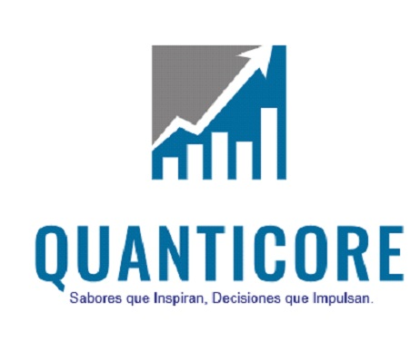
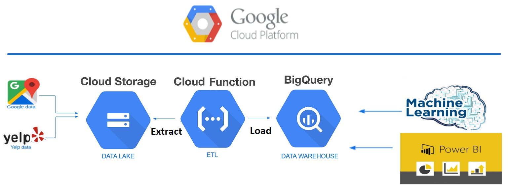
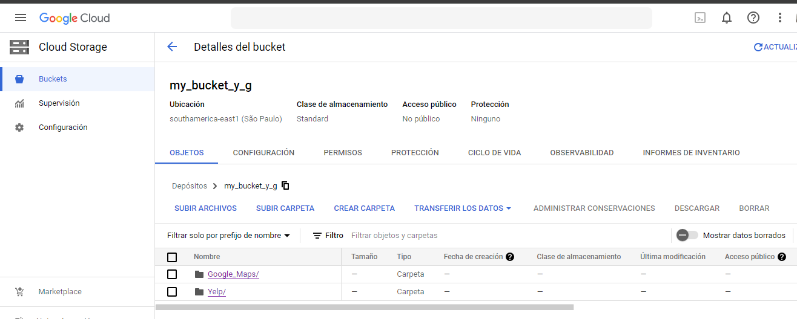
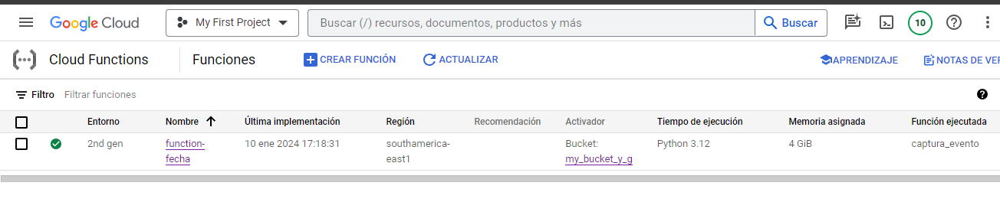
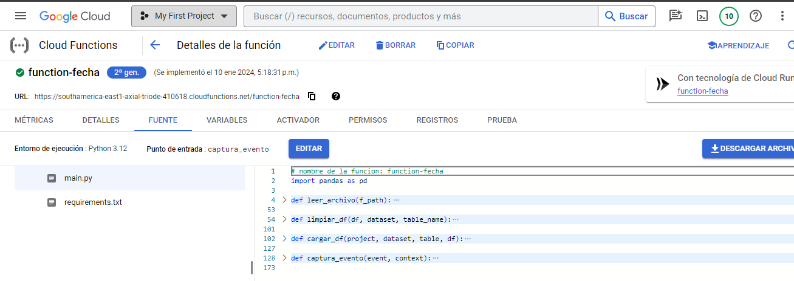
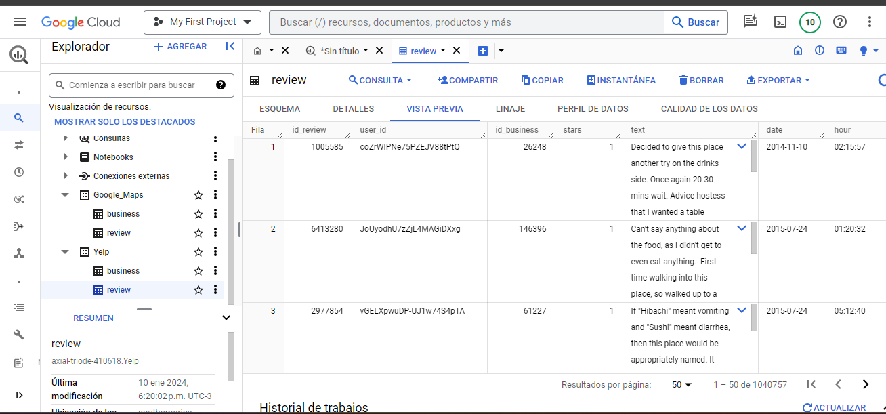
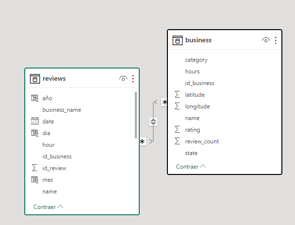

----

 

# 
  Procesamiento de Datos en Google Cloud Plataform

 
En nuestro proyecto, hemos diseñado un proceso eficiente para organizar y procesar datos utilizando servicios de <b>Google Cloud</b>. Aquí está el esquema de nuestro PIPELINE:

 
 
 

Imagen ilustrativa del Pipeline

## INDICE

- <!-- omit in toc -->
  <!-- omit in toc -->
  - [Data Lake](#data-lake)
  - [Cloud Functions](#cloud-functions)
  - [Data Warehouse](#data-warehouse)
  - [Modelo ER](#modelo-er)
  - [Ventajas](#ventajas)
  - [Tecnologías Utilizadas](#tecnologías-utilizadas)
  - [Autores](#autores)

## Data Lake

La parte inicial de este proyecto es cargar los datos sin procesar que se nos proporcionaron y almacenarlos en nuestro Data Lake, en Google Cloud llamado "Google Cloud Storage (GCS)"

Caracteristicas: 
- Almacenamiento flexible: GCS puede alojar datos de prácticamente cualquier tipo y formato, desde archivos de texto simples hasta videos, imágenes, datos de sensores y logs de aplicaciones.
- Escala sin límites: GCS está diseñado para escalar y adaptarse a grandes volúmenes de datos. Puedes almacenar petabytes de información sin preocuparte por limitaciones de espacio.
- Costos eficaces: GCS ofrece diferentes clases de almacenamiento optimizadas para distintos casos de uso y presupuestos. Esto permite almacenar datos de forma rentable, dependiendo de su frecuencia de acceso y necesidad de procesamiento.
- Interfaz amigable

 
 

Imagen ilustrativa de nuestro Cloud Storage

## Cloud Functions

Cloud Functions es un servicio serverless que nos permite ejecutar código sin tener que preocuparnos por la infraestructura subyacente. Esto nos permite automatizar el proceso de carga de datos y escalarlo de forma sencilla.

La Cloud Function ejecuta un proceso ETL eficiente para extraer datos del archivo, transformarlos según nuestras necesidades y cargar la información procesada en BigQuery. El proceso ETL incluye los siguientes pasos:

- Extracción: Los datos se extraen del archivo.
- Transformación: Los datos se limpian, filtran y se agregan en función de las necesidades del negocio.
- Carga: Los datos procesados se cargan en BigQuery en un dataset y una tabla personalizados.
  
Las ventajas de utilizar Cloud Functions para este tipo de aplicación incluyen:

- Escalabilidad: Cloud Functions se puede escalar para adaptarse a grandes volúmenes de datos.
- Coste: Cloud Functions se paga por uso, por lo que solo pagamos por los recursos que utilizamos.
- Facilidad de uso: Cloud Functions es fácil de usar y configurar.

Imagen ilustrativa de nuestra Cloud Function

## Data Warehouse
En Google Cloud, llamado "BigQuery (GBQ)".

Caracteristicas: 
- Análisis de datos masivo: BigQuery es un servicio de análisis de datos masivo que puede procesar y analizar grandes volúmenes de datos de forma rápida y eficiente.
- Integración con GCS: BigQuery tiene una estrecha integración con GCS, lo que permite cargar datos de GCS directamente en BigQuery sin necesidad de moverlos o prepararlos previamente.
- Características avanzadas: BigQuery ofrece una serie de características avanzadas para el análisis de datos, como machine learning, inteligencia artificial y aprendizaje automático. 

Mediante Google SQL podremos realizar nuestras propias consultas. El equipo de Data Scientist y Data Analytics haran uso de estos datos estructurados para sus análisis.
 

Imagen ilustrativa de nuestra BigQuery

----

## Modelo ER

# Modelo Entidad-Relación (MER): Jerárquico Simple
Nuestro modelo de relaciones adopta una estructura jerárquica simple, donde se establece una relación directa entre dos entidades principales: Business (Negocio - Padre) y Reviews (Reseñas - Hijo).

Descripción del Modelo:
Business (Negocio - Padre):

Representa la entidad principal que actúa como el "padre" en nuestra jerarquía.
Contiene información detallada sobre los negocios, como la ubicación, categorías y atributos específicos del negocio.
Reviews (Reseñas - Hijo):

Representa la entidad secundaria que está vinculada directamente con la entidad Business.
Contiene reseñas asociadas a un negocio específico.
Se establece una relación "uno a muchos" entre Business y Reviews, ya que un negocio puede tener múltiples reseñas.
Razón para la Clasificación:
Aunque podríamos considerar la posibilidad de un modelo "Copo de Nieve" debido a la relación "muchos a uno" que existe entre las entidades, hemos optado por describir nuestro modelo como "Jerárquico Simple". Esto se debe a que, en nuestra estructura, la relación entre Business y Reviews es "uno a muchos". En un modelo Copo de Nieve típico, esperaríamos encontrar una entidad intermedia que normalmente representaría atributos compartidos o detalles adicionales sobre las reseñas. Sin embargo, en nuestro caso, la relación es más directa y simple, sin entidades intermedias.

Este modelo jerárquico simple refleja eficazmente la relación de un negocio que puede tener múltiples reseñas asociadas a él.

----

## Ventajas

Algunas ventajas específicas de este pipeline incluyen:

- Flexibilidad: El pipeline puede adaptarse a diferentes fuentes de datos y tipos de datos.
- Escalabilidad: El pipeline puede escalarse para adaptarse a grandes volúmenes de datos.
- Costes eficaces: El pipeline puede gestionarse de forma rentable.
- Análisis avanzado: El pipeline permite realizar análisis avanzados de datos.
----
## Video a demostracion sobre la utilizacion y funcionamiento de Google Cloud Functions

- Video:(https://www.youtube.com/watch?v=x3LRqdlpB9U&t=55s)
----

## Tecnologías Utilizadas

- 
- 
- 
- 
- 
- 

--------------
## Autores

García, Robertino	- Data Enginner
 
Martinez H, M. Gabriela - 	Data Enginner
