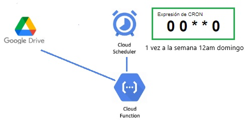
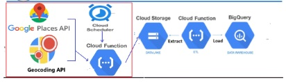

----

 

# 
  Mejoras en el Proyecto en Google Cloud Platform propuestas al Producto Minimo Viable (MVP)

----

Durante el desarrollo de nuestro proyecto en Google Cloud Platform, hemos explorado y probado diversas soluciones para optimizar la gestión de datos y mejorar la eficiencia de nuestras operaciones. En este documento, detallamos algunas de las estrategias que implementamos y las lecciones aprendidas en el proceso.

# ZAPIER: Una Inmersión en la Automatización

Inicialmente, exploramos la posibilidad de utilizar Zapier, una herramienta potente de automatización que se integra con Google Drive. Nuestro objetivo era establecer una conexión entre una carpeta de Drive y Google Cloud Storage, automatizando la transferencia de datos. A pesar de la eficacia de Zapier y su capacidad de inteligencia artificial, decidimos descartarlo debido a preocupaciones sobre la seguridad del sitio. En última instancia, nos dimos cuenta de que Google Cloud ofrecía soluciones más seguras y personalizadas utilizando Cloud Functions y Cloud Scheduler.

# Cloud Function y Cloud Scheduler: Programación Eficiente

Implementamos Cloud Functions y Cloud Scheduler para automatizar tareas específicas en intervalos regulares. Programamos un cron para ejecutar estas funciones una vez a la semana, los días domingos a las 0:00 am. Aunque esta solución proporcionaba una automatización valiosa, identificamos que la actualización de la información no reflejaba datos en tiempo real, lo que generó la necesidad de buscar alternativas.

# Google Maps API: Manteniendo la Información Actualizada

Con el objetivo de garantizar la actualización constante de nuestros conjuntos de datos y proporcionar recomendaciones precisas a nuestros clientes, exploramos la integración de la API de Google Maps. Utilizando una combinación de Cloud Functions y Cloud Scheduler, diseñamos una solución que nos permitió mantener nuestros datos al día de manera eficiente. Esto aseguraba que nuestra aplicación no quedara obsoleta y pudiera seguir brindando un servicio relevante a lo largo del tiempo.

A lo largo de este proceso de mejora, hemos evaluado y adaptado nuestras estrategias para maximizar la eficiencia y la seguridad de nuestras operaciones en Google Cloud Platform. Las lecciones aprendidas han contribuido significativamente a nuestra capacidad para mantener nuestro proyecto actualizado y orientado al futuro.
