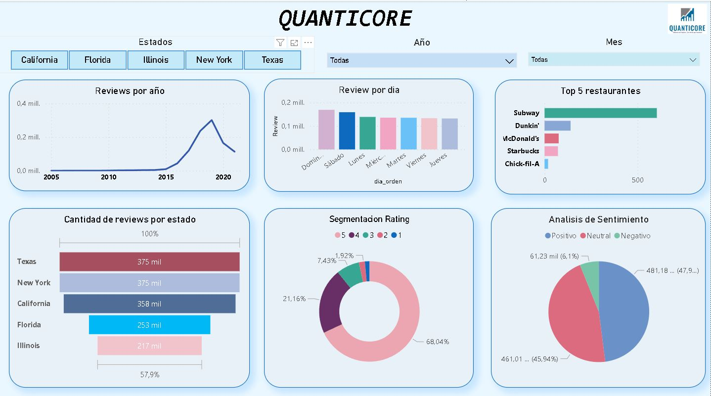
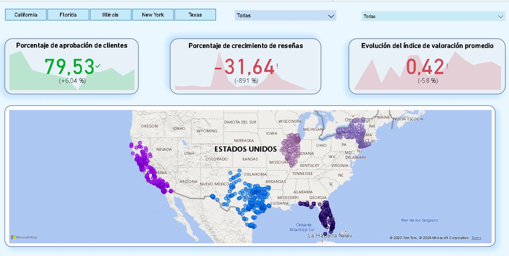

 

# 
  Dashboard

En nuestro análisis centrado en los estados de California, Florida, Illinois, Nueva York y Texas, basado en su Producto Interno Bruto (PBI), hemos recopilado valiosa información que se presenta a través de un conjunto de seis gráficos. Estos gráficos ofrecen una visión detallada de las tendencias y patrones relacionados con las revisiones de los lugares, destacando elementos cruciales para entender la dinámica de la experiencia del cliente y la industria en general.

Tendencias Temporales de Revisiones:
El primer gráfico examina las revisiones a lo largo de los años. Observamos un crecimiento constante hasta el 2020, donde se evidencia una disminución abrupta debido al confinamiento global por la pandemia de Covid-19. A pesar de este año atípico, las revisiones en general han ido en aumento, estableciendo una sólida base para nuestro modelo de recomendación.

Segmentación de Revisiones por Día de la Semana:
La segunda visualización revela que los días con mayor actividad de revisiones son los sábados y domingos. Esta tendencia sugiere que las personas aprovechan el fin de semana para explorar nuevos lugares y compartir sus experiencias culinarias fuera de casa.

Top 5 de Restaurantes con Mejores Calificaciones:
La tercera gráfica destaca el top 5 de restaurantes con las mejores calificaciones, liderado por Subway. Este análisis revela la preferencia general por la comida rápida en los estados seleccionados, brindando insights valiosos sobre las preferencias gastronómicas de la población.

Análisis de Revisiones por Estado:
El cuarto gráfico muestra que Texas, Nueva York y California son los estados con mayor número de reseñas. Esto se atribuye en gran medida a su atractivo turístico, generando una mayor actividad de reseñas y opiniones en comparación con otros estados.

Segmentación de Ratings y Sentimientos:
Los gráficos cinco y seis ofrecen una perspectiva detallada de las valoraciones numéricas y los sentimientos expresados en las revisiones. La mayoría de los lugares obtienen calificaciones de 5, y las reseñas tienden a ser mayoritariamente positivas, proporcionando una valiosa información sobre la satisfacción general de los clientes.

KPIs:
Como Indicadores Clave de Rendimiento (KPIs), nos centramos en el porcentaje de aprobación de clientes, el crecimiento de revisiones y la evolución del índice de valoración promedio. Aunque excluimos los años 2020 y 2021 debido a la influencia de la pandemia, observamos que en el año 2019 se cumplieron las metas establecidas. Este análisis refleja un crecimiento constante en la satisfacción del cliente y la calidad de las revisiones a lo largo del tiempo.

Al considerar el último año evaluado, evidenciamos que las tendencias positivas persisten, indicando mejoras continuas en la satisfacción del cliente y la percepción general de los usuarios. Con esta comprensión profunda de nuestros datos, ahora damos paso a nuestros científicos de datos para explicar cómo nuestro modelo de machine learning potencia nuestras recomendaciones.

 

Imagen ilustrativa de nuestro Dashboard

Imagen ilustrativa de nuestros Kpis

[Ver Dashboard](https://drive.google.com/drive/folders/1xTiHybbvF-B-diQrhaYDmnanCjLj1BQ-)
